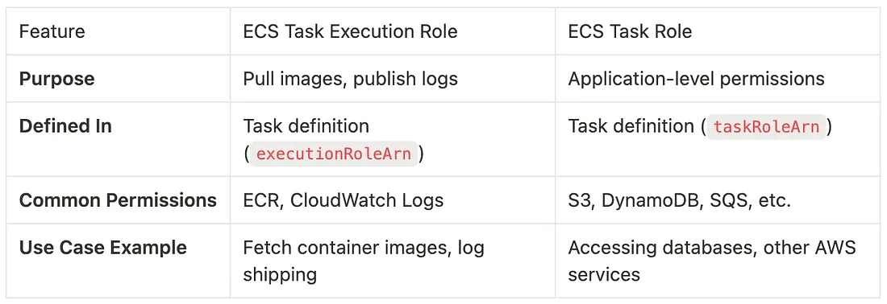
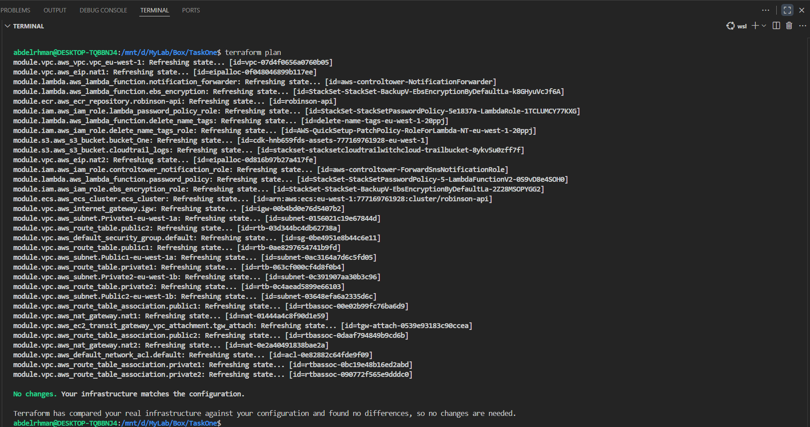

# Robinson API Infrastructure - Terraform Import Project

In production environments, AWS resources often exist before Terraform adoption. This project demonstrates how to import existing infrastructure into Terraform state, enabling Infrastructure as Code (IaC) management.

---

## Project Overview

**Robinson API Infrastructure Components:**
- **VPC**: `10.133.63.64/26` with 4 subnets across 2 availability zones
- **S3 Buckets**: CDK assets, CloudTrail logs, and deployment artifacts
- **Lambda Functions**: Password policy, notification forwarding, EBS encryption, and tag management
- **IAM Roles**: Service roles for Lambda functions
- **ECS Cluster**: Container orchestration for Robinson API
- **ECR Repository**: Docker image storage for application containers

---

## Prerequisites

### 1. AWS Access
Use provided AWS credentials (Access Key)

### 2. Install Required Tools
```bash
# AWS CLI v2
aws configure
# Access Key, Secret Key, eu-west-1, json

# Terraform
terraform -version

# Verify AWS access
aws sts get-caller-identity
```

### 3. Development Environment
- **VS Code** with HashiCorp Terraform extension
- **Git** for version control

---

## Project Structure

```
TaskOne/
├── main.tf                
├── provider.tf            
├── .terraform.lock.hcl    
└── modules/
    ├── vpc/               
    │   ├── main.tf        # VPC, subnets, and networking
    │   ├── variables.tf   
    │   └── outputs.tf     
    ├── s3/                
    │   ├── s3.tf          # Bucket definitions
    │   └── outputs.tf     
    ├── lambda/            
    │   ├── lambda.tf      # Function definitions
    │   ├── variables.tf   
    │   └── outputs.tf     
    ├── iam/               
    │   ├── main.tf        # Role definitions
    │   └── outputs.tf     
    ├── ecs/               
    │   ├── main.tf        # Cluster configuration
    │   ├── variables.tf   
    │   └── outputs.tf     
    └── ecr/               
        ├── main.tf        # Repository configuration
        ├── variables.tf   
        └── outputs.tf     
```
- Separation of Concerns: Each module handles one AWS service/componen
- Reusability: Modules can be used across different environments

---

## Resource Discovery and import Process

### 1. Initialize Terraform
```bash
terraform init
```

### 2. Discover Existing Resources
```
# List resources
aws resourcegroupstaggingapi get-resources --region=eu-west-1 --output text

# VPC Module Resources
aws ec2 describe-vpcs
aws ec2 describe-subnets
aws ec2 describe-internet-gateways
aws ec2 describe-nat-gateways
aws ec2 describe-addresses
aws ec2 describe-route-tables
aws ec2 describe-network-acls
aws ec2 describe-security-groups

# S3 Module Resources
aws s3 ls

# Lambda Module Resources
aws lambda list-functions

# IAM Module Resources
aws iam list-roles

# ECS Module Resources
aws ecs list-clusters

# ECR Module Resources
aws ecr describe-repositories
```

### 3. Import Resources by Module

- Add resource to .tf fill
- Check required arguments from docs
- Fill them with values from live resource

#### VPC and Networking

```
terraform import module.vpc.aws_vpc.[local_resource_name] [vpc_id]
terraform import module.vpc.aws_subnet.[local_resource_name] [subnet_id]
```
---
#### ECS and ECR

List all cluster arns to get its name
```
aws ecs list-clusters
```
To find services in that cluster
```
aws ecs list-services --cluster robinson-api
```
To find the task definition used by that service
```
aws ecs describe-services --cluster robinson-api --services service-robinson-api --query "services[*].taskDefinition" --output text
```
Get the roles from the task definition
```
aws ecs describe-task-definition --task-definition RobinsonApiCdkStackTaskDef1FB649D8:3 | grep -i role
```

When we run containers on ECS (Fargate or EC2), there are two roles:
- **Task Execution Role**: Allows ECS to pull container images from ECR and write logs to CloudWatch
-  **Task Role**: Allows your application code inside the container to access AWS services (S3, DynamoDB, etc.)


In our scenario we have  
`ecsTaskExecutionRole` has the ECS execution policy which means ECS can start tasks, fetch ECR images, write logs.  
`robinson_api_task_role` has no permissions which means the app doesn’t need AWS API calls right now. If later your app needs S3 or DynamoDB, we’d attach a policy here

ecr lifecycle policy to add if it has
```
aws ecr get-lifecycle-policy --repository-name robinson-api
```

```
terraform import module.ecs.aws_ecs_cluster.[local_resource_name] [cluster_name]
terraform import module.ecr.aws_ecr_repository.[local_resource_name] [repository_name]
```

---
#### S3 Buckets

```
aws s3 ls
terraform import module.s3.aws_s3_bucket.[local_resource_name] [bucket_name]
```
---
#### Lambda Functions (correction)

Commands used to describe lambda functions
```
aws lambda list-functions
aws lambda get-function --function-name [function-name]
```
> We can identify the ownership of each lambda function from its name to determine if we're going to import it or not. Terraform should not import resources owned by another **IaC system (cloudformation)** or **any other AWS managed service** as we'll get split-brain (two tools fight over one resource), and drift on every update (Control Tower changes it while Terraform wants it back).

```
aws lambda list-tags --resource [function-arn]
```
We've all function carrying `aws:cloudformation:` tags with StackSet stack names and logical IDs  
`StackSet-StackSetPasswordPolicy` and `StackSet-StackSet-BackupV-EbsEncryptionByDefault` are owned by CloudFormation StackSet  
`aws-controltower-NotificationForwarder` is owned by AWS Control Tower  
`delete-name-tags-eu-west-1` is owned by AWS Systems Manager Quick Setup  

In plain english these Lambdas are helper/automation pieces that those AWS services own, update, and sometimes replace. They’re not a app code, so if Terraform tried to own them too, you’d have two bosses for one resource → drift, conflicts, and possibly broken governance

---
#### IAM Roles

```bash
aws iam list-roles --query "Roles[].RoleName" --output table
terraform import module.iam.aws_iam_role.[local_resource_name] [role_name]
```

To decide which role to import:  
1- look at role names: focus on application-specific roles, not infrastructure/service roles  
2- check trust policy of that role to know what services can use these roles

To inspect each role in details and check who can assume the role (trust policy)
```
aws iam get-role --role-name [role-name]
```
With IAM roles, we typically also need to import:  
1-  This shows the managed policies attached to the role. Managed policy is a policy that lives as a separate object in IAM as it could be (AWS Managed Policy or	Customer Managed Policy)  
```
aws iam list-attached-role-policies --role-name his shows the managed policies attached to the role.
```
2- Inline Policies - Custom policies directly attached to the role  
```
aws iam list-role-policies --role-name ecsTaskExecutionRole
```

```
terraform import module.iam.aws_iam_role_policy_attachment.ecs_task_execution_role_policy ecsTaskExecutionRole/arn:aws:iam::aws:policy/service-role/AmazonECSTaskExecutionRolePolicy
```
---
### 4. Fix Configuration Drift

When `terraform plan` shows differences, use the generate-config feature:

```bash
terraform plan -generate-config-out=generated.tf
```
This will generates correct configuration new file (generated.tf) with the complete, accurate configuration that matches your live AWS resources.

**Steps to copy from generated file to module:**

1. **Find matching resources** - Compare resource names between files
2. **Compare attributes** - Check which attributes exist in generated but missing in module
3. **Copy missing attributes** - Add any missing attributes to your module file
4. **Remove import blocks** - Delete import statements from main.tf after successful import
5. **Clean up** - Delete the generated file once configuration is corrected

### 5. Validation
```bash
terraform plan
```

---
---

## Configuration Highlights

### Lambda Functions with Lifecycle Management
```hcl
resource "aws_lambda_function" "password_policy" {
  function_name = "StackSet-StackSetPasswordPolicy-5-LambdaFunctionV2-0S9vD8e4SOH0"
  role          = "arn:aws:iam::777169761928:role/StackSet-StackSetPasswordPolicy-5e1837a-LambdaRole-1TCLUMCY77KXG"
  package_type  = "Zip"
  
  lifecycle {
    ignore_changes = [s3_bucket, s3_key, source_code_hash, handler, runtime]
  }
}
```

### Lifecycle Management is Required for Lambda Functions (Explanation)

When importing existing Lambda functions, we encounter a unique challenge:

**The Problem**
- AWS Lambda stores function code internally and doesn't expose exact S3 bucket/key details through APIs
- When querying Lambda functions, AWS only returns `RepositoryType: "S3"` and a temporary download URL
- Terraform requires `s3_bucket` and `s3_key` attributes for Zip package types, but we don't know the real values

**The Solution:**
```hcl
lifecycle {
  ignore_changes = [s3_bucket, s3_key, source_code_hash, handler, runtime]
}
```
Why lifecycle ignore_changes:
When you import a Lambda function, Terraform needs to know where the code comes from (s3_bucket and s3_key). But since AWS doesn't tell us the real values, we use dummy placeholders.  
Without ignore_changes, Terraform would try to "fix" the Lambda function by uploading our dummy code, overwriting the real function code.  
With ignore_changes, Terraform says: "I'll manage this Lambda function's configuration (name, role, etc.) but I won't touch the code deployment part."  
Simple analogy: It's like managing a house but ignoring what furniture is inside - you control the address and ownership, but don't mess with the contents.

This approach allows us to import and manage existing Lambda functions without disrupting their operational code.

---

## Workflow Summary

1. **Initialize**: `terraform init`
2. **Discover**: Use AWS CLI to identify resources
3. **Import**: Use `terraform import` for each resource
4. **Validate**: Run `terraform plan` to confirm no changes
5. **Maintain**: Regular validation and updates

---

## Conclusion and Resources 

This project successfully demonstrates importing existing AWS infrastructure into Terraform state management. The Robinson API infrastructure is now fully managed as code, enabling version control, collaboration, and automated deployment processes.

[understanding-ecs-task-execution-role-and-task-role-key-differences-and-use-cases](https://aws.plainenglish.io/understanding-ecs-task-execution-role-and-task-role-key-differences-and-use-cases-17693e05c758)